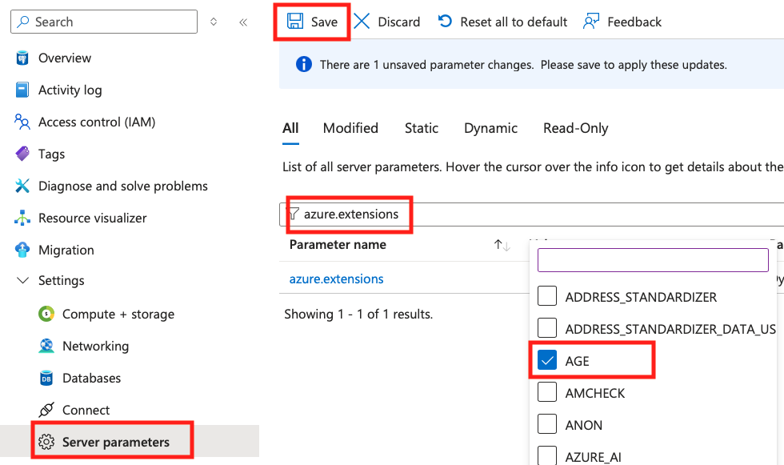
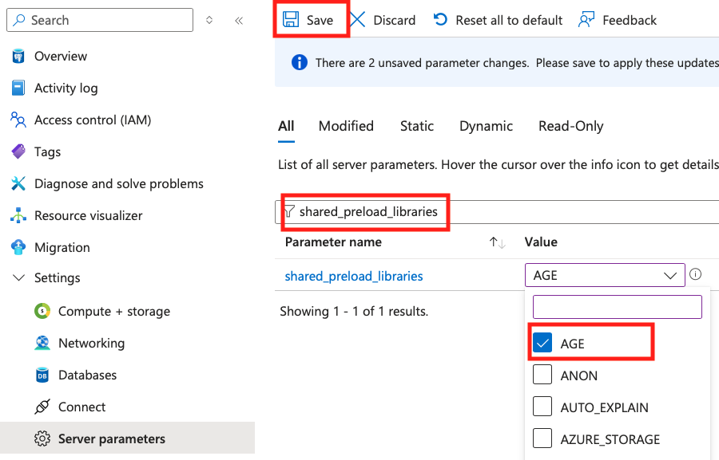
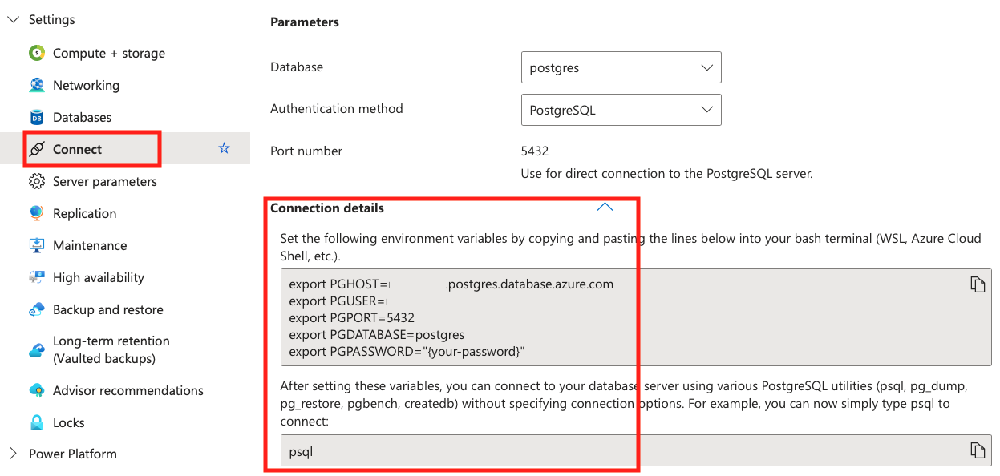

# How to enable AGE

## Steps to enable AGE

In Azure Database for PostgreSQL Flexible Server (including Elastic Cluster), AGE is already installed, but it needs to be loaded as an extension.

After deploying PostgreSQL, select `Server parameters` in Azure Portal and set the following parameters in two places:

1. azure.extensions

When you enter **azure.extensions** in the parameter filter, the Extensions available in Azure Database for PostgreSQL will be displayed. Check `AGE`.


2. shared_preload_libraries

When you enter **shared_preload_libraries** in the parameter filter, Extensions that can be preloaded will be displayed. Check `AGE`.


3. After checking the two items, click the [Save] button. The server will restart to enable the AGE Extension.

4. After the restart is complete, connect to PostgreSQL with the `psql` interpreter. The connection method is displayed when you select `Connect` in Azure Portal.


5. Once connected to PostgreSQL, execute the following command to enable the AGE Extension.

```sql
CREATE EXTENSION IF NOT EXISTS AGE CASCADE;
```

If `CREATE EXTENSION` is displayed, the AGE Extension is enabled.

## Set schemas

As will be described in detail later, AGE adds a schema called `ag_catalog` and handles graph data within this schema. Therefore, when handling AGE's graph data in `psql` or programming languages such as Python, you need to add `ag_catalog` to the schema search path.

```sql
SET search_path=ag_catalog,"$user",public;
```

```python
import psycopg as pg
with pg.Connection.connect(con_str + " options='-c search_path=ag_catalog,\"$user\",public'") as con:
```

[Prev: Introduction](01_introduction.md) | [Next: Implementation of AGE](03_implementation.md)
